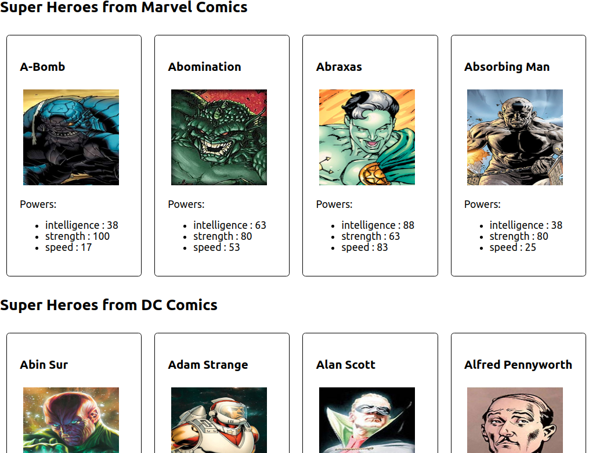
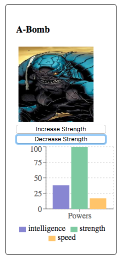

# CS3249-2020-React-Tutorial

## Starting Exercise

1. [Download](https://github.com/janakanuwan/CS3249-2020-React-Exercise) or clone
```bash
git clone https://github.com/janakanuwan/CS3249-2020-React-Exercise.git
```

2. Go to the React root directory/folder (e.g. `part-1` or `part-2`)
```bash
cd part-1
```

3. Install dependencies (will create `node_modules` directory)
```bash
npm install
```

4. Start the application
```bash
npm start
```

---

## Part 1: Creating the UI with based on view tree

We want to change the UI as follows:

 

Data Source: [SuperHero API](https://superheroapi.com/)

>- What is the view tree?
>- What are the view components? 
>- What are the properties of view components?


### Steps

1. Create view components using React.

**EXERCISE**: Add the power list

>- What is `props`?
>- How the variables are accessed in [JSX](https://devhints.io/react#jsx-patterns)?  [NOTE: curly brackets]


```javascript
// src/view/PowerStatsView.jsx
import React from 'react';

class PowerStatsView extends React.Component{

    // NOTE: render method should be implemented if you use ES6 classes
    render(){
        // NOTE: we extract the data first from 'props'
        const {data} = this.props;

        // NOTE: In list we have to add 'key' attribute. Why?
        const powerList = Object.entries(data).map((name, index) =>
            <li key={index}> {name[0]} : {name[1]} </li>
        );

        return (
            <div>
                <p>Powers: </p>
                {/* NOTE: JSX comments */}

                {/* EXERCISE: add the power list */}

                


            </div>
        );
    }
}

// NOTE: you need to 'export' the component to access it by other files (if all components are in a single file, you do not need to 'export')
export default PowerStatsView;
```
>- What is meant by 'export'? Hint: [Modules](http://exploringjs.com/es6/ch_modules.html)

```css
/* src/view/hero-view.css */
.hero-view {
    width: 170px;
    margin: 10px;
    border: 1px solid #000;
    border-radius: 5px;
    padding: 20px;

    display: flex;
    flex-direction: column;
    justify-content: flex-start;
}

.hero-view > img {
    width: 150px;
    height: 150px;
    margin: 5px;
}
```

**EXERCISE**: Import the PowerStatsView and add it to HeroView

```javascript
// src/view/HeroView.jsx
import React from 'react'

// importing React Component

// EXERCISE: import the PowerStatsView and add it
// NOTE: Do we need to add ".jsx" extension?


// import css
import './hero-view.css'

// NOTE: React component starts with Capital letter
class HeroView extends React.Component{

    render(){
        // NOTE: we extract the data first from 'props'
        const {hero} = this.props;

        return (
            // EXERCISE: pass css property 'class-name' = "hero-view"
            <div >
                <h3>{hero.name}</h3>
                
                {/* NOTE: we can use the child component directly in JSX */}
                {/* NOTE: we pass the data by a known name (i.e. 'data') */}

                {/*EXERCISE: Add the PowerStatsView here and pass the 'powerstats' from 'hero' */}


            </div>
        );
    }
}

export default HeroView;
```

```css
/* src/view/publisher-panel.css */
.publisher-panel {
    display: flex;
    flex-flow: row wrap;
}

.publisher-panel-header {
    flex:1 0 100%;
}
```

```javascript
// src/model/HeroView.js
import React from 'react';

import HeroView from './HeroView'

import './publisher-view.css'

class PublisherView extends React.Component{

    constructor(props) {
        super(props);
    }

    render(){
        const {heroes} = this.props;

        // What will happen if heroes array is empty?
        const publisher = heroes[0]["publisher"];

        // NOTE: HTML uses simple names for its attributes, but JSX uses camel case!
        return (
            <div>
                <h2>Super Heroes from {publisher} </h2>
                <div className={"publisher-view"}>
                    {/* Use JS map function to create multiple heroes with looping*/}
                    {heroes.map( (heroData) =>
                        <HeroView key={heroData.id} hero={heroData}/>)}
                </div>
            </div>
        );
    }
}

export default PublisherView;
```

2. Create the data classes using JS.

>- NOTE: For the assigment 3, you may not need to separate them!

```javascript
// src/model/PowerStats.model.js
class PowerStats {
    constructor(intelligence, strength, speed) {
        // constructor function to initialize object
        this.intelligence = intelligence;
        this.strength = strength;
        this.speed = speed;
    }
}

export default PowerStats;
```

```javascript
// src/model/Hero.model.js
class Hero{
    
    constructor(id, name, powerstats = {}, image = '', publisher = ''){
        this.id = id;
        this.name = name
        this.powerstats = powerstats;
        this.image = image;
        this.publisher = publisher;
    }
}

export default Hero;
```


3. Render the react components from `src/App.js`

>- We will use data from a file to initialize the page

```javascript
import React from 'react';

import './App.css';

// React component
import PublisherView from './view/PublisherView'

// model classes
import Hero from './model/Hero.model'
import PowerStats from "./model/PowerStats.model";

// data [NOTE: generally data comes from a database or a backend server]
import rawData from './data'

// convert the data to supported format
const parseHeroData =(dataArray = []) =>  dataArray.map( (dataItem) =>
    new Hero(
        dataItem.id,
        dataItem.name,
        new PowerStats(dataItem.powerstats.intelligence, dataItem.powerstats.strength, dataItem.powerstats.speed),
        dataItem.image,
        dataItem.publisher
    )
);

// filter by publisher
const filteredHeroesByPublisher = (publisher, heroDataArray) =>
    heroDataArray.filter(hero => publisher === hero.publisher);

// App Component in functional format instead of extending from React.Component
function App() {
    // initialize
    const data = parseHeroData(rawData);
    const publishers = ['Marvel Comics', 'DC Comics'];

    return (
        <div>
            {/* use the JS functions directly inside the JSX syntax! */}
            {publishers.map( (publisher) => <PublisherView key={publisher} heroes={filteredHeroesByPublisher(publisher, data)} />)}
        </div>
    );
}

export default App;
```

---

## Part 2: Adding interactions

We want to change the UI as follows [NOTE: Now 'Powers' are shown in a bar chart!]:




### Steps

1. Go to `part-2` directory and start the app
```bash
npm install
npm start
```

2. Let's use '[Recharts](http://recharts.org/en-US/)'. Install '[recharts](https://github.com/recharts/recharts)' as a dependency
```bash
npm i -S recharts
# or 'npm install --save recharts'
```
>- Why is it added as (production) dependency?

3. Add a [barchart](http://recharts.org/en-US/examples/SimpleBarChart) to `src/view/PowerStatsChart.jsx`
    - Note how the BarChart component was imported and used!
```javascript
// src/view/PowerStatsChart.jsx
import React from 'react'
import {
    BarChart, Bar, Cell, XAxis, YAxis, CartesianGrid, Tooltip, Legend,
} from 'recharts'

class PowerStatsChart extends React.Component{

    render(){
        // NOTE: data format should be directly supported
        const {data} = this.props;

        return (
            <BarChart
                width={200}
                height={200}
                data={data}
                margin={{
                    top: 5, right: 5, left: 0, bottom: 5,
                }}
            >
                <CartesianGrid strokeDasharray="3 3"/>
                <XAxis dataKey="name"/>
                <YAxis/>
                <Tooltip/>
                <Legend/>
                {/* What is meany by 'dataKey'? */}
                <Bar dataKey="intelligence" fill="#8884d8"/>
                <Bar dataKey="strength" fill="#82ca9d"/>
                <Bar dataKey="speed" fill="#ffc658"/>
            </BarChart>
        );
    }
}

export default PowerStatsChart;
```

4. Modify the `PowerStatsView.jsx` as follows.

**EXERCISE**: Add the 'PowerStatsChart'

```javascript
// src/view/PowerStatsChart.jsx
import React from 'react'
import PowerStatsChart from "./PowerStatsChart";

class PowerStatsView extends React.Component {
    // static utility function that maps the data parsed from props to Chart supported format
    static graphDataMapper(data){
        const {intelligence, strength, speed} = data;
        return (
            [
                {
                    name: 'Powers', intelligence: intelligence, strength: strength, speed: speed,
                }
            ]
        );
    }

    render() {
        const {data} = this.props;

        return (
            <div>
                {/* EXERCISE: Add the 'PowerStatsChart'*/}


            </div>
        );
    }
}

export default PowerStatsView;
```

>- What is the relationship between `<Bar dataKey='power1' />` and graph legends and values?
>- What is the relationship between `<XAxis dataKey='name' />` and graph X-label?
>- How to fix the legends to show 'intelligence', 'strength' and 'speed'?

5. Let's add buttons to `src/view/HeroView.jsx`

```javascript
// src/view/HeroView.jsx
class HeroView extends React.Component{

    render(){
        const {hero} = this.props;

        return (
            <div className={"hero-view"}>
                <h3>{hero.name}</h3>
                

                {/* New buttons */}
                <button>Increase Strength</button>
                <button>Decrease Strength</button>

                <PowerStatsView data={hero.powerstats}/>
            </div>
        );
    }
}
```

6. Let's handle events to change the chart values

**EXERCISE**: Add 'increaseStrength()' and 'increaseStrength()' functions

```javascript
// src/view/HeroView.jsx
class HeroView extends React.Component{

    constructor(props){
        super(props);

        const {hero} = props;

        // This binding is necessary to make `this` work in the callback
        this.increaseStrength = this.increaseStrength.bind(this);
        this.decreaseStrength = this.decreaseStrength.bind(this);
    }

    // functions to handle clicks
    increaseStrength(e) {
        // TODO
        console.log(e);
    }

    decreaseStrength(e) {
        // TODO
        console.log(e);
    }

    render(){
        const {hero} = this.props;

        return (
            <div className={"hero-view"}>
                <h3>{hero.name}</h3>
                

                <button onClick={this.increaseStrength}>Increase Strength</button>
                <button onClick={this.decreaseStrength}>Decrease Strength</button>
                {/* NOTE: Now we use 'state' instead of 'props' */}
                <PowerStatsView data={this.state}/>
            </div>
        );
    }
}
```
>- Why 'onClick' is in camel case instead of 'onclick' as in HTML button format?
>- Why do you have to bind functions inside the constructor?

7. Using local state to show values
    - Where should we keep that state? How do we decide that? Hint: [Thinking in React](https://reactjs.org/docs/thinking-in-react.html)
    - Which data should we keep in the _state_?
    - What are the difference between _state_ abd _props_?
    

**EXERCISE*: Add _state_ using _this.state_ inside constructor function

```javascript
// src/view/HeroView.jsx
class HeroView extends React.Component{

     constructor(props){
        super(props);

        const {hero} = props;
        // NOTE: adding local state to class
        // NOTE: we create a local state, and set the initial values from 'props'
        this.state = {
            intelligence: hero.powerstats.intelligence,
            strength: hero.powerstats.strength,
            speed: hero.powerstats.speed
        };

        // This binding is necessary to make `this` work in the callback
        this.increaseStrength = this.increaseStrength.bind(this);
        this.decreaseStrength = this.decreaseStrength.bind(this);
    }

    // functions

    render(){
        const {hero} = this.props;

        return (
            <div className={"hero-view"}>
                <h3>{hero.name}</h3>
                

                <button onClick={this.increaseStrength}>Increase Strength</button>
                <button onClick={this.decreaseStrength}>Decrease Strength</button>
                {/* NOTE: Now we use 'state' instead of 'props' */}
                <PowerStatsView data={this.state}/>
            </div>
        );
    }
}
```

8. Changing the state based on events
    - What is the expected behavior of the state when you click "Increase Strength" (or "Decrease Strength")?
    - How can we change the state? Hint: Use the inbuilt `this.setState()` to update the component's local state
    - IMPORTANT: Three things you should know about [setState()](https://reactjs.org/docs/state-and-lifecycle.html#using-state-correctly)
           - Do Not Modify State Directly 
           - State Updates May Be Asynchronous
           - State Updates are Merged
```javascript
// src/view/HeroView.jsx

	// ...

    increaseStrength() {
        // NOTE: we do not directly change the state since it should be immutable
        // NOTE: we can assign a new value to a property of the state instead of replacing whole state!
        console.log("Before clicking Increase Strength Button");
        console.log(this.state);
        this.setState( state => ({
            strength: state.strength + 5
        }));
        console.log("After clicking Increase Strength Button");
        console.log(this.state);
    }
    
    decreaseStrength() {
        this.setState( state => ({
            strength: state.strength - 5
        }));
    }

	// ...

```

9. [Optional] How do we move the `state` to support MV* patterns?
	- Pass the functions with `props`
	- See [Lifting State Up](https://reactjs.org/docs/lifting-state-up.html)
